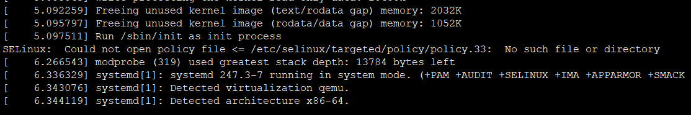
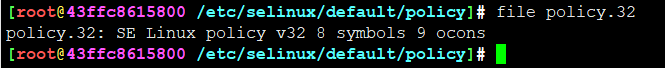

# 发行版错误告警汇总


## /etc/selinux/targeted/policy/policy.33:  No such file or directory



```
[    5.095797] Freeing unused kernel image (rodata/data gap) memory: 1052K
[    5.097511] Run /sbin/init as init process
SELinux:  Could not open policy file <= /etc/selinux/targeted/policy/policy.33:  No such file or directory
[    6.266543] modprobe (319) used greatest stack depth: 13784 bytes left
[    6.336329] systemd[1]: systemd 247.3-7 running in system mode. (+PAM +AUDIT +SELINUX +IMA +APPARMOR +SMACK +SYSVINIT +UTMP +LIBCRYPTSETUP +GCRYPT +GNUTLS +ACL +XZ +LZ4 +ZSTD +SECCOMP)
[    6.343076] systemd[1]: Detected virtualization qemu.
[    6.344119] systemd[1]: Detected architecture x86-64.
```


如果手动创建空文件，则会报

```
SELinux:  Could not map policy file /etc/selinux/targeted/policy/policy.33:  Invalid argument
```



文件格式也比较特殊，那就看看谁调用它的


---
