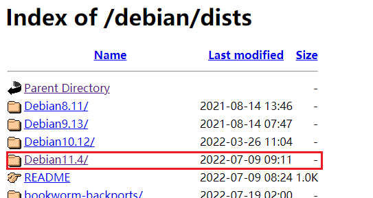
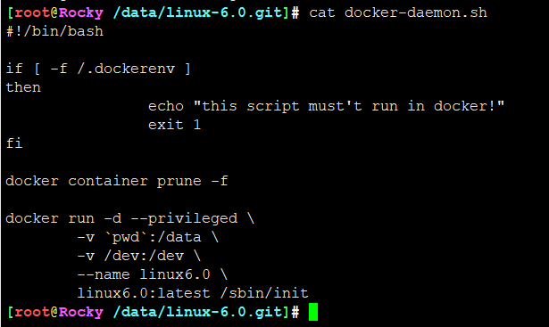
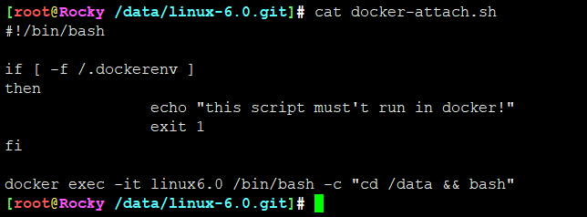
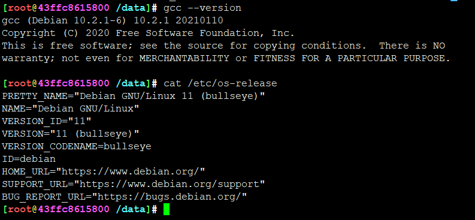
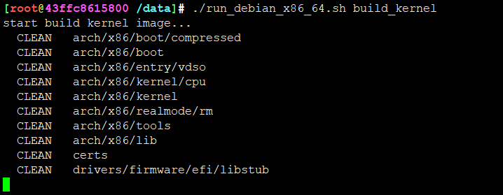
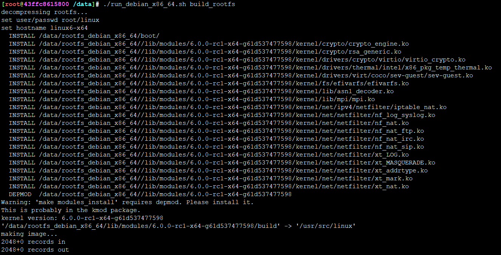
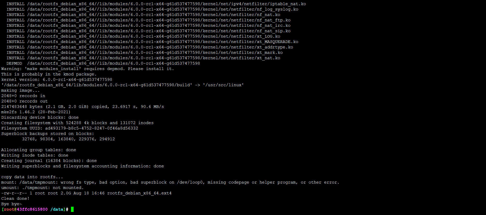
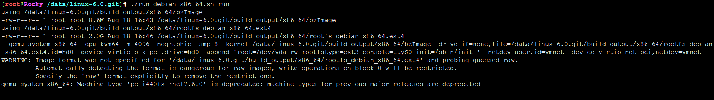
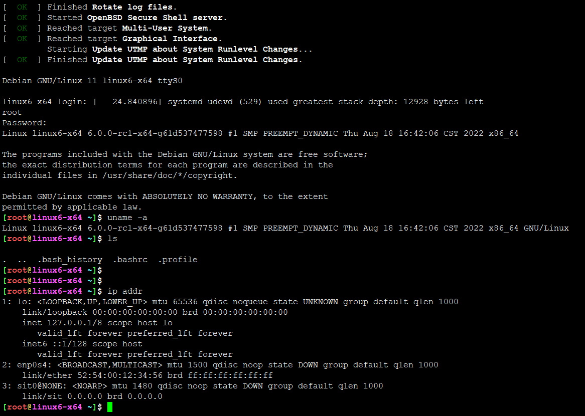
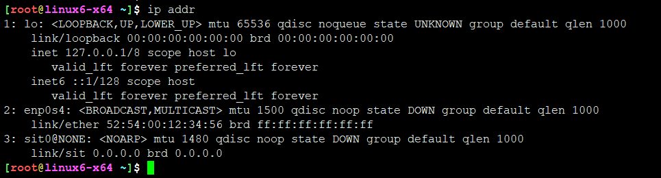

<!-- MDTOC maxdepth:6 firsth1:1 numbering:0 flatten:0 bullets:1 updateOnSave:1 -->

- [x86_64](#x86_64)   
   - [内核编译环境](#内核编译环境)   
   - [在容器中编译内核](#在容器中编译内核)   
   - [在容器中制作rootfs](#在容器中制作rootfs)   
   - [运行内核](#运行内核)   

<!-- /MDTOC -->
# x86_64


## 内核编译环境

依然使用docker镜像编译，隔离编译环境差异



选用的debian最新版本


Dockerfile 核心内容：

```
FROM debian:bullseye

COPY bashrc /root/.bashrc
COPY sources.list /etc/apt/sources.list
RUN apt-get update && \
	apt-get install -y systemd systemd-sysv && \
	apt-get install -y vim gcc build-essential make \
		libncurses-dev \
		apt-file \
		xfsprogs \
		file git flex bison \
		bc libelf-dev libssl-dev && \
	rm -rf /etc/localtime && \
	ln -vfs /usr/share/zoneinfo/Asia/Shanghai /etc/localtime
```

在build_docker目录，执行build.sh完成编译环境docker镜像制作。当然，本机需提前安装好docker环境，基本功。



启动容器，作为daemon



之后attach到容器中



默认将内核目录映射到容器/data目录下

## 在容器中编译内核

执行对应架构编译脚本build_kernel

该脚本会先make mrproper

然后make debian_defconfig

再编译bzImage




```
  ZOFFSET arch/x86/boot/zoffset.h
  OBJCOPY arch/x86/boot/vmlinux.bin
  AS      arch/x86/boot/header.o
  LD      arch/x86/boot/setup.elf
  OBJCOPY arch/x86/boot/setup.bin
  BUILD   arch/x86/boot/bzImage
Kernel: arch/x86/boot/bzImage is ready  (#1)
kernel build done![0]
-rw-r--r-- 1 root root 8.6M Aug 18 16:43 /data/build_output/x86_64/bzImage
/data/build_output/x86_64/bzImage: Linux kernel x86 boot executable bzImage, version 6.0.0-rc1-x64-g61d537477598 (root@43ffc8615800) #1 SMP PREEMPT_DYNAMIC Thu Aug 18 16:42:06 CST 2022, RO-rootFS, swap_dev 0x8, Normal VGA
Clean done!
Bye bye~
```


内核镜像会备份到 ```/data/build_output/x86_64/``` 目录下


## 在容器中制作rootfs

```
./run_debian_x86_64.sh build_rootfs
```






## 运行内核





默认网络不启用，手动dhclien即可




---
